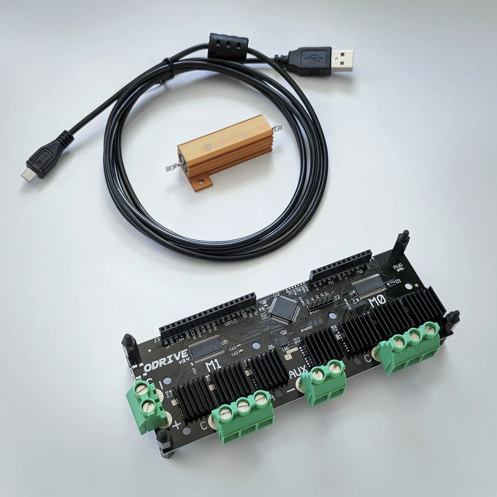
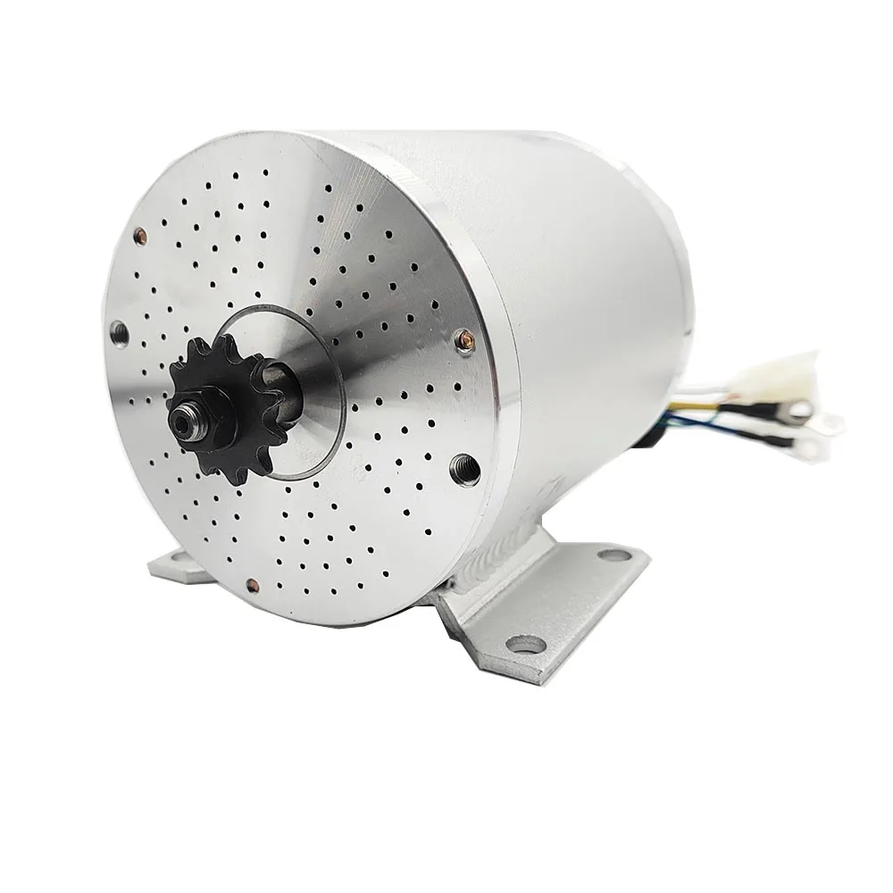

# ODrive Motor Control

This repository contains scripts to backup ODrive configurations and control ODrive motors for a differential drive robot.

## Hardware Setup

### ODrive Controller



The ODrive v3.6 is a high-performance motor controller designed for robotics applications. It features dual-axis control, closed-loop position, velocity, and current control.

**Specifications:**
- Dual-axis control (can drive two motors)
- 48V input voltage
- Up to 100A peak current
- Supports various encoder types
- USB and CAN bus interfaces

### Motor



The system uses a 1000W 48V brushless DC motor with a 1000 pulse-per-revolution rotary encoder.

**Specifications:**
- 1000W power rating
- 48V operating voltage
- 1000PPR rotary encoder
- Designed for high-torque applications

## Problem Description

The ODrive motor controller was experiencing a significant delay (approximately 20 seconds) between sending velocity commands and the motor responding. This issue has been addressed with configuration changes, and now the motor responds quickly to commands.

## Current Setup

The current configuration has been optimized for fast response time. The key parameters that were adjusted include:

- Input Filter Bandwidth
- Velocity Ramp Rate
- Velocity Controller Gains
- Startup Closed Loop Control settings

**Important:** Do not modify the current configuration as it has been optimized for your specific setup.

## Project Structure

- `backup_current_config.py` - Script to backup the current ODrive configuration as odrivetool commands
- `motor_control.py` - Simple program to control motor velocity and position
- `arrow_key_control.py` - Script to control the robot using keyboard arrow keys
- `odrive_backups/` - Directory containing backup files
- `old/` - Directory containing old scripts and files (for reference only)

## Backup Script

The `backup_current_config.py` script allows you to backup the current ODrive configuration as odrivetool commands. This is useful for saving your configuration so you can restore it later if needed.

**Usage:**
```bash
./backup_current_config.py
```

This will create a backup file in the `odrive_backups/` directory with a timestamp in the filename. You can copy and paste the commands from this file into odrivetool to restore the configuration if needed.

## Differential Robot Controller

The `motor_control.py` script provides a comprehensive interface to control both motors (axis0 and axis1) of an ODrive-powered differential drive robot. It includes automatic calibration for production use and does not modify any configuration parameters.

**Usage:**
```bash
# Run the script in interactive mode
./motor_control.py

# Move forward at specified velocity
./motor_control.py forward 8.0

# Move backward at specified velocity
./motor_control.py backward 8.0

# Turn left at specified velocity
./motor_control.py left 5.0

# Turn right at specified velocity
./motor_control.py right 5.0

# Move with specific linear and angular velocity
./motor_control.py move 0.5 0.2

# Set wheel velocities directly
./motor_control.py velocity 8.0 8.0

# Set wheel positions directly
./motor_control.py position 10.0 10.0

# Get robot status
./motor_control.py status

# Clear errors
./motor_control.py clear
```

### Interactive Mode

In interactive mode, you can:
- Move forward/backward (`f <velocity>`, `b <velocity>`)
- Turn left/right (`l <velocity>`, `r <velocity>`)
- Move with linear and angular velocity (`m <linear> <angular>`)
- Set wheel velocities directly (`v <left> <right>`)
- Set wheel positions directly (`p <left> <right>`)
- Stop the robot (`s`)
- Get robot status (`status`)
- Clear errors (`clear`)
- Exit the program (`q`)

### Arrow Key Control

The `arrow_key_control.py` script provides an intuitive way to control the robot using keyboard keys. This makes manual control much easier, especially for testing and demonstrations.

**Usage:**
```bash
# Run the arrow key control script
python3 arrow_key_control.py
```

**Controls:**
- `w` or `↑` (Up Arrow) - Move forward
- `s` or `↓` (Down Arrow) - Move backward
- `a` or `←` (Left Arrow) - Turn left
- `d` or `→` (Right Arrow) - Turn right
- `+` or `=` - Increase velocity
- `-` or `_` - Decrease velocity
- `Space` - Stop robot (puts motors in IDLE mode)
- `q` or `Esc` - Exit

The arrow key control script automatically handles the transition between IDLE mode and closed loop control:
- When you press Space to stop, the motors are set to IDLE mode to reduce power consumption and motor wear
- When you press any movement key, the script automatically switches back to closed loop control

### Power-Saving Mode

The motor control system now includes a power-saving feature that automatically changes the axis mode to IDLE when the robot is stopped. This provides several benefits:

1. **Reduced Power Consumption**: Motors consume less power in IDLE mode
2. **Reduced Motor Wear**: Motors generate less heat when not actively holding position
3. **Extended Battery Life**: Important for battery-powered robots

When any velocity command is received, the system automatically switches back to closed loop control mode, ensuring seamless operation. This feature is implemented in both the `motor_control.py` and `arrow_key_control.py` scripts.

### Calibration

There are two ways to calibrate the ODrive:

#### 1. Standard Calibration (Requires Motor Movement)

The standard calibration process requires motor movement to measure motor parameters and determine encoder offset. This should be done in a controlled environment where it's safe for the motor to move.

```bash
# Calibrate both axes
./motor_control.py calibrate

# Calibrate a specific axis
./motor_control.py calibrate --axis 0

# Force recalibration even if already calibrated
./motor_control.py calibrate --force
```

The standard calibration process:
1. Displays a safety warning and asks for confirmation
2. Checks if calibration is needed (motors not calibrated or encoders not ready)
3. Performs motor calibration if needed (applies voltage to measure resistance/inductance)
4. Performs encoder calibration if needed (rotates motor to determine encoder offset)
5. Saves the calibration results

You can check the calibration status without performing calibration:
```bash
./motor_control.py check
```

#### 2. No-Movement Calibration (Recommended for Production)

For production environments where the robot cannot move during setup, we provide several ways to apply pre-calibrated values without any motor movement:

##### Option A: Using the load_calibration.py script

This approach uses a JSON file to store and load calibration values:

**Step 1: Perform a one-time calibration in a controlled environment**

```bash
# First, calibrate the ODrive normally (this also saves the configuration to the ODrive)
./motor_control.py calibrate

# Then, export the calibration values to a file for future use
./load_calibration.py save --file my_robot_calibration.json
```

**Step 2: In production, load the saved calibration values**

```bash
# Load calibration values without moving the motor
./load_calibration.py load --file my_robot_calibration.json
```

##### Option B: Using the generate_precalibrated_config.py script

This approach generates a Python module that can be automatically imported by motor_control.py:

**Step 1: Perform a one-time calibration in a controlled environment**

```bash
# First, calibrate the ODrive normally
./motor_control.py calibrate

# Then, generate a Python module with the current calibration values
./generate_precalibrated_config.py
```

This will create a file called `precalibrated_config.py` that contains all the calibration values from your current ODrive.

**Step 2: In production, simply use motor_control.py**

The motor_control.py script will automatically detect and use the precalibrated_config.py module if it exists. No additional steps are needed - just run your normal movement commands:

```bash
# The script will automatically use the pre-calibrated values
./motor_control.py forward 8.0
```

##### Option C: Using the odrive_calibration_utils.py script (Recommended)

This approach provides the most robust calibration and saving functionality, following the same patterns as the official ODrive firmware:

**Step 1: Perform a one-time calibration in a controlled environment**

```bash
# Run the calibration utility
./odrive_calibration_utils.py
```

This interactive script will:
1. Check the current calibration status
2. Provide options to calibrate specific axes or both
3. Properly handle the saving process and ODrive reboot
4. Verify calibration after reboot

**Step 2: In production, use the pre-calibrated values**

Once calibration is complete and the pre-calibrated flags are set, you can use the motor_control.py script as normal:

```bash
# The script will use the pre-calibrated values
./motor_control.py forward 8.0
```

**Important Notes About Calibration and Saving:**

Based on the ODrive firmware implementation:

1. **Proper Calibration Sequence:**
   - Motors must be disarmed (in IDLE state) before calibration
   - After calibration, pre_calibrated flags must be set
   - Configuration must be saved to persist calibration

2. **Saving Configuration:**
   - The ODrive will reboot after saving configuration
   - Motors must be disarmed before saving
   - The system needs time to reconnect after reboot

3. **Safety Considerations:**
   - Always ensure the robot is in a safe position before calibration
   - Verify calibration was successful before using in production
   - Handle errors and timeouts appropriately

The `odrive_calibration_utils.py` script handles all these considerations automatically, making it the recommended approach for proper calibration and configuration saving.

### Robot Movement

The script provides several ways to control the robot's movement:

1. **Basic Movement Commands**: Simple forward, backward, left, and right commands.
2. **Differential Drive Control**: Control the robot with linear and angular velocity.
3. **Direct Wheel Control**: Set the velocity or position of each wheel independently.
4. **Keyboard Control**: Use arrow keys or WASD keys for intuitive manual control.

#### Motor Direction Configuration

For differential drive robots, the motors are often mounted in opposite orientations, requiring one motor to rotate in the opposite direction for the robot to move straight. The script handles this automatically with direction constants:

```python
# Constants for motor direction - Edit these based on your robot's configuration
LEFT_MOTOR_DIRECTION = 1    # 1 for normal, -1 for inverted
RIGHT_MOTOR_DIRECTION = -1  # 1 for normal, -1 for inverted
```

These constants are applied to all movement commands, so you don't need to worry about inverting velocities manually. If your robot's wheels are rotating in opposite directions when they should be moving in the same direction, you can adjust these constants in the `motor_control.py` file.

### Velocity Control

For best performance, use velocity commands in the range of 7.0-10.0, which provide consistent sub-millisecond response times.

#### Gradual Velocity Changes

The script now implements gradual velocity changes to provide smoother acceleration and deceleration. When you set a new velocity, the motor will gradually ramp up or down to the target velocity instead of changing suddenly. This provides several benefits:

1. **Smoother Movement**: Prevents jerky starts and stops
2. **Reduced Mechanical Stress**: Less strain on motors and mechanical components
3. **Better Control**: More predictable robot behavior, especially with payloads

This feature is automatically applied to all movement commands, so you don't need to do anything special to use it. The gradual velocity change:
- Takes about 200ms to complete (10 steps with 20ms delay)
- Is quick enough to maintain responsive control
- Is smooth enough to prevent sudden jerks

### Position Control

Position control allows you to move the wheels to specific positions. The position is specified in turns (revolutions).

## Restoring Configuration

If you need to restore a previous configuration, you can use one of the backup files in the `odrive_backups/` directory. Simply open the file, copy the commands, and paste them into odrivetool.

## Testing Steps

Follow these steps to test the ODrive motor control system:

### Initial Setup and Calibration

1. **Connect the Hardware**
   - Connect the ODrive to your computer via USB
   - Connect the motor and encoder to the ODrive
   - Power on the ODrive with a 48V power supply

2. **Backup Current Configuration**
   ```bash
   ./backup_current_config.py
   ```

3. **Calibrate the Motor and Encoder**
   ```bash
   ./motor_control.py calibrate
   ```
   - This will perform a full calibration sequence
   - The motor will move during this process
   - Wait for the calibration to complete

### Basic Movement Tests

4. **Test Forward Movement**
   ```bash
   ./motor_control.py forward 5.0
   ```
   - The motor should gradually accelerate to the specified velocity
   - Verify smooth acceleration without jerky movement

5. **Test Backward Movement**
   ```bash
   ./motor_control.py backward 5.0
   ```
   - The motor should gradually accelerate in the opposite direction
   - Verify smooth deceleration and direction change

6. **Test Turning**
   ```bash
   ./motor_control.py left 3.0
   ./motor_control.py right 3.0
   ```
   - Verify that the motors rotate in opposite directions for turning

7. **Test Stopping**
   ```bash
   ./motor_control.py forward 5.0
   # Wait a moment, then
   ./motor_control.py velocity 0.0 0.0
   ```
   - Verify that the motor stops smoothly
   - Verify that the motors switch to IDLE mode when stopped

### Advanced Tests

8. **Test Gradual Velocity Changes**
   - Run the motor at different speeds and observe the transitions
   ```bash
   ./motor_control.py forward 2.0
   # Wait a moment, then
   ./motor_control.py forward 8.0
   # Wait a moment, then
   ./motor_control.py forward 4.0
   ```
   - Verify that velocity changes are smooth without sudden jerks

9. **Test Position Control**
   ```bash
   ./motor_control.py position 10.0 10.0
   ```
   - Verify that the motor moves to the specified position

10. **Test Interactive Mode**
    ```bash
    ./motor_control.py
    ```
    - Try various commands in interactive mode
    - Test different velocities and movement patterns

11. **Test Arrow Key Control**
    ```bash
    python3 arrow_key_control.py
    ```
    - Test controlling the robot with keyboard keys
    - Verify that the motors switch to IDLE mode when stopped (Space key)
    - Verify that the motors switch back to closed loop control when movement keys are pressed

### Production Setup Tests

12. **Test No-Movement Calibration**
    ```bash
    # Generate pre-calibrated configuration
    ./generate_precalibrated_config.py
    
    # Restart the ODrive, then
    ./motor_control.py forward 5.0
    ```
    - Verify that the motor moves without requiring calibration

13. **Verify Error Handling**
    - Intentionally create an error (e.g., block the motor)
    - Check error status and clear errors
    ```bash
    ./motor_control.py status
    ./motor_control.py clear
    ```

14. **Test Power-Saving Mode**
    ```bash
    # Start moving
    ./motor_control.py forward 5.0
    # Wait a moment, then stop
    ./motor_control.py velocity 0.0 0.0
    # Check status to verify IDLE mode
    ./motor_control.py status
    # Start moving again to verify automatic mode switching
    ./motor_control.py forward 5.0
    ```
    - Verify that the motors switch to IDLE mode when stopped
    - Verify that the motors automatically switch back to closed loop control when movement commands are sent

## Troubleshooting

If you encounter any issues with the motor control:

1. Check that the ODrive is properly connected and powered on
2. Make sure no other program is currently accessing the ODrive
3. Try rebooting the ODrive by disconnecting and reconnecting the power
4. Check for any errors using odrivetool:
   ```python
   import odrive
   odrv0 = odrive.find_any()
   print(f"Axis error: {odrv0.axis0.error}")
   print(f"Motor error: {odrv0.axis0.motor.error}")
   print(f"Encoder error: {odrv0.axis0.encoder.error}")
   ```
5. Clear any errors:
   ```python
   odrv0.clear_errors()
